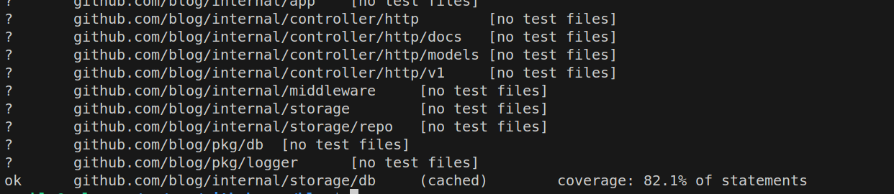

# Blog

## 1. Clone Project
```
https://github.com/murtazokhongofurov/blog.git
```

## 2. Add Environment Variables file using example.env file
HTTP_PORT=8181
DB_USER=username
DB_PASS=pass
DB_HOST=localhost
DB_PORT=5432
DB_NAME=dbname
AUTH_FILE_PATH=./config/auth.conf
CSV_FILE_PATH=./config/roles.csv
SIGNING_KEY=dfkljadlkvnwe834riekkj3489uf39ri3
MAIL_USERNAME=username
MAIL_PASSWORD=password
SMTP_HOST=host
LOG_LEVEL=debug

## 3. Run migrations by this following command
```
    make migrate_up
```

## 4. Run project
```
make run
```

or

```
go run cmd/main.go
```

## 5. Open Swagger Api docs and check apis

http://localhost:8181/v1/docs/index.html

## 6. Run test by command bellow
```
go test ./... -cover
```

## Test Result:



